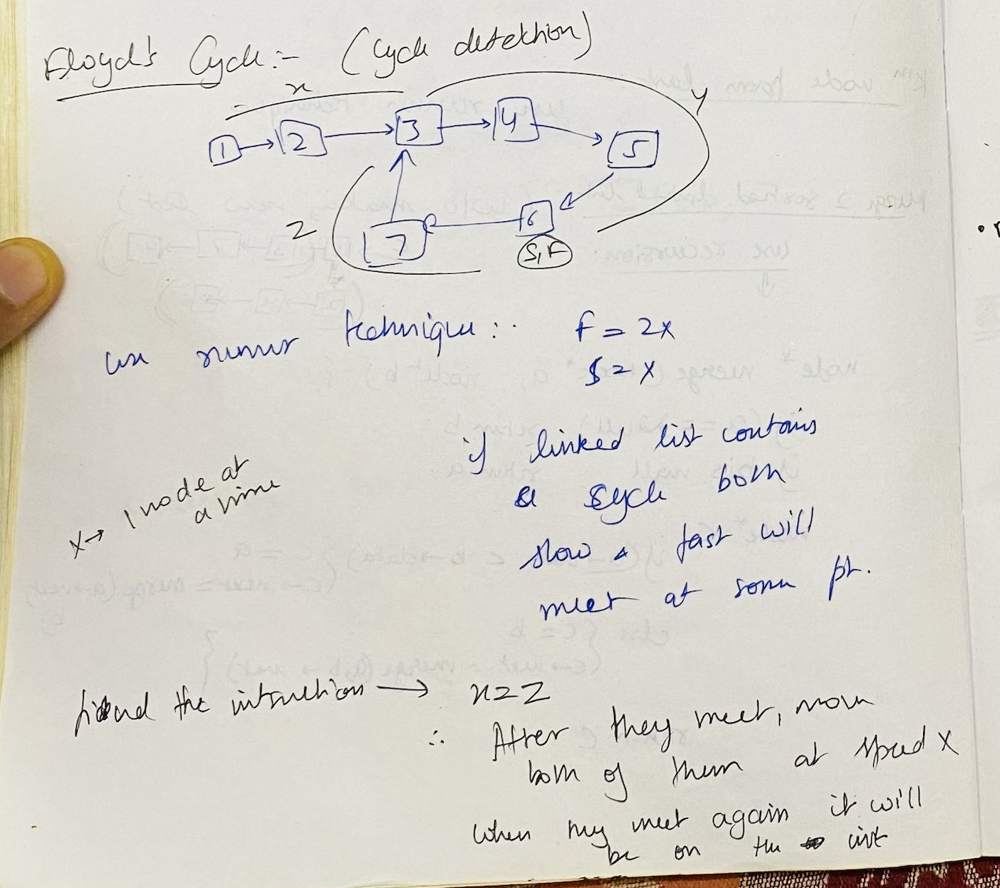

# Misc Topics

## Stack

- Last finished 3 Feb 2025

### [Min Stack](https://leetcode.com/problems/min-stack/description/) ⭐️
> Design a stack that supports push, pop, top, and retrieving the minimum element in constant time.

- Was able to think on my own but soluton was slightly better (store redundant elements in a new stack)

### [Largest Rectangle in Histogram](https://leetcode.com/problems/largest-rectangle-in-histogram/description/) ⭐️⭐️⭐️
> Given an array of integers heights representing the histogram's bar height where the width of each bar is 1, return the area of the largest rectangle in the histogram.

- Hard ques, Requires revision from time to time

<br>

----
---

## Linked List

- Last finished 3 Jan

### [Reverse Linked List](https://leetcode.com/problems/reverse-linked-list/description/) ⭐️⭐️

- Struggled on this due to lack of practise

### [Linked List Cycle II](https://leetcode.com/problems/linked-list-cycle-ii/description/) ⭐️⭐️

> Given the head of a linked list, return the node where the cycle begins. If there is no cycle, return null.

- Start both `slow` and `fast` from `head`
- Once `fast` and `slow` pointers meet, move `slow` to `head` and then move both `fast` and `slow` one node at a time, they will meet at junction



### [Find the Duplicate Number](https://leetcode.com/problems/find-the-duplicate-number/description/) ⭐️⭐️⭐️

> Given an array of integers `nums` containing `n + 1` integers where each integer is in the range `[1, n]` inclusive. There is only one repeated number in nums, return this repeated number.

- Variation of above question. Difficult to think on your own

### [LRU Cache](https://leetcode.com/problems/lru-cache/description/) ⭐️⭐️⭐️

- Use Double linked list and hashmap

### [Merge k Sorted Lists](https://leetcode.com/problems/merge-k-sorted-lists/description/) ⭐️

- Use heap of list nodes

### [Reverse Nodes in k-Group](https://leetcode.com/problems/reverse-nodes-in-k-group/description/) ⭐️⭐️⭐️

- Quite hard, must revice


- [Jump Game](https://leetcode.com/problems/jump-game/description/): Keep a right Max pointer

- [Jump Game II](https://leetcode.com/problems/jump-game-ii/description/) ⭐️⭐️: Slightly tricky, What is the range you can reach from each jump?

- [Gas Station](https://leetcode.com/problems/gas-station/description/): Did it first go

- [Hand of Straights](https://leetcode.com/problems/hand-of-straights/description/): Doable

- [Merge Triplets to Form Target Triplet](https://leetcode.com/problems/merge-triplets-to-form-target-triplet/description/) : Not intuitive

- [Partition Labels](https://leetcode.com/problems/partition-labels/description/) : easy approach

- [Valid Parenthesis String](https://leetcode.com/problems/valid-parenthesis-string/) ⭐️⭐️ : Not intuitive

    ```
    We initiate two pointers, one starting from the left and the other from the right of the array.

    Starting from the left, we iterate through the array, counting the occurrences of open brackets '(' and asterisks '*'. Whenever we encounter a closed bracket ')', we decrement the count of open brackets. This decrement operation mimics the process of matching an open bracket with a closed one.

    Simultaneously, we traverse from the right of the array, counting the occurrences of closed brackets ')' and asterisks '*'. Whenever we encounter an open bracket '(', we decrement the count of closed brackets. This simulates the process of matching a closed bracket with an open one.

    Throughout this process, if either the count of open brackets or the count of closed brackets falls below zero (i.e., becomes negative), we immediately conclude that the sequence is invalid, as it indicates a surplus of closed brackets without corresponding open ones, or vice versa.

    If neither of the counters becomes negative throughout the iteration, the sequence is valid, and we return true.
    ```

<br>

----
---

## Math & Geometry

- Rotate Image : i <-> j then i <-> n-i
- Spiral Matrix
- Set Matrix Zeroes: store the zeros on 0th row and 0th column
- [Happy Number](https://leetcode.com/problems/happy-number/description/) ⭐️⭐️ Not easy, use hashmap or floyd to detect cycle
- [Plus One](https://leetcode.com/problems/plus-one/description/) : Okay question to test basics, good for practise after a long time.
- Multiply Strings: TODO, dont feel like doing
- Detect Squares: Looks easy


<br>

----
---

## Interview Problems:
- 


<br><br><br><br><br>
<br><br><br><br><br>
<br><br><br><br><br>
<br><br><br><br><br>

Greedy :

1. Activity Selection : sort by finishing time, always take the first activity and then so on 

2. Fractional Knapsack 

3. Job Sequencing : take most profitable job first and do it as late as possible

4. Huffman Coding (TODO)


 
