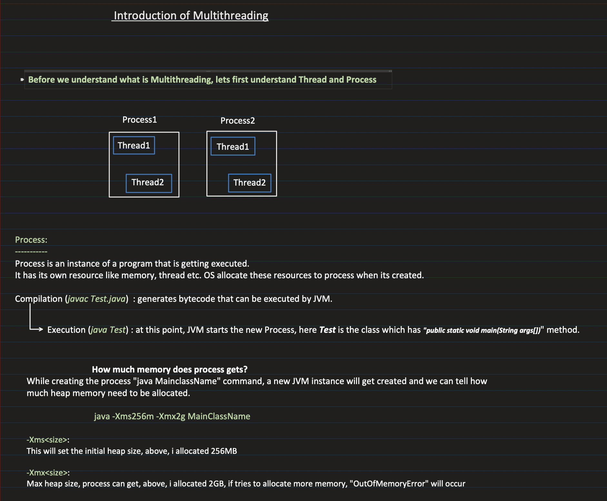
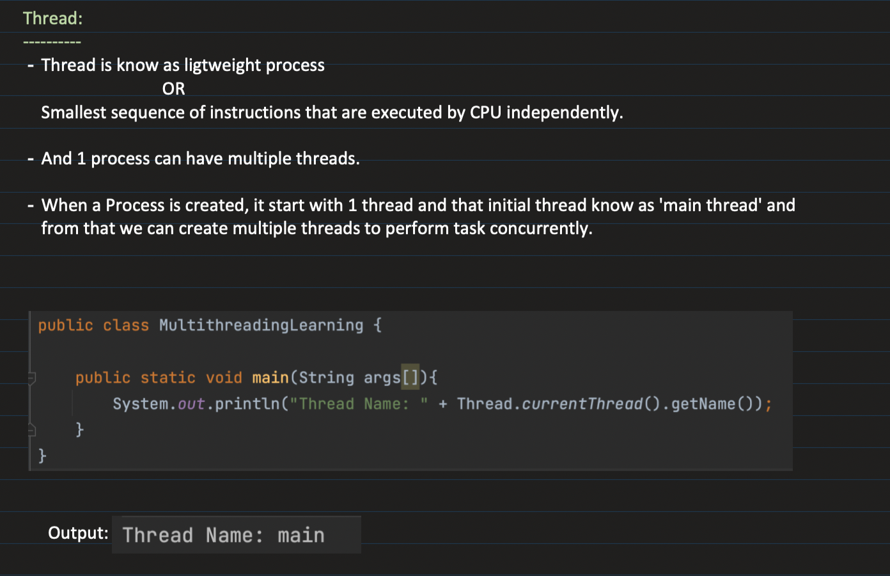
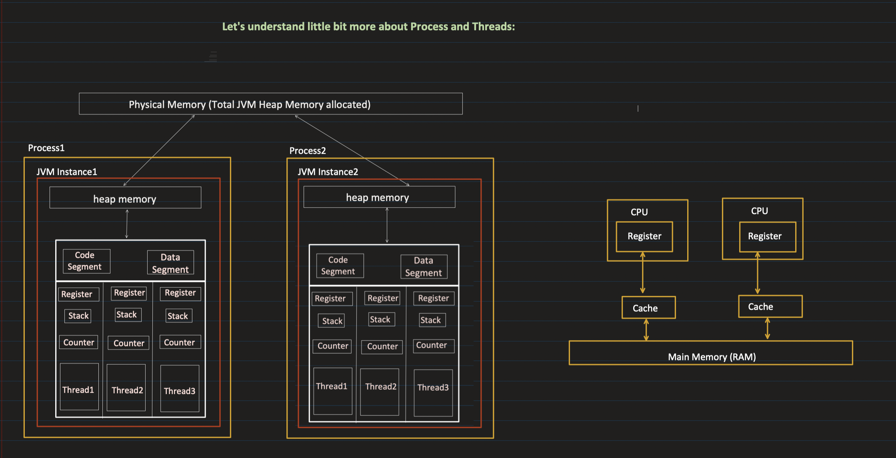
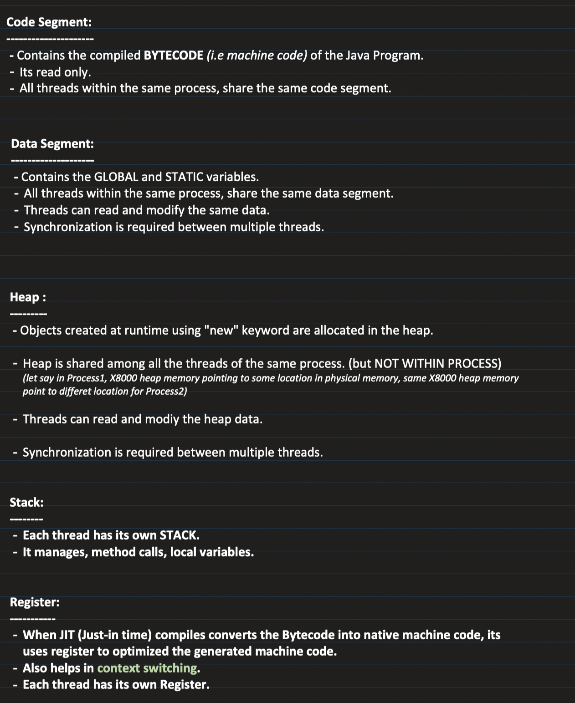
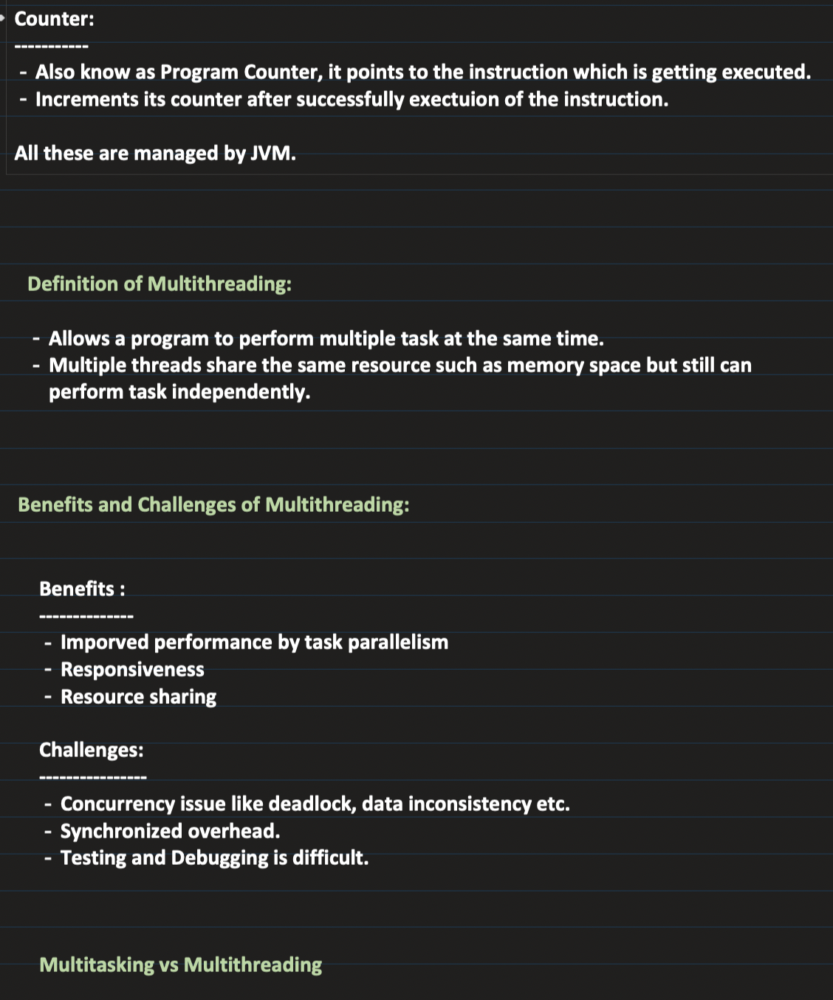

## [29. Multithreading and Concurrency in Java: Part1 | Threads, Process and their Memory Model in depth](https://www.youtube.com/watch?v=TpYIcJN9EV8&ab_channel=Concept%26%26Coding-byShrayansh)

[Notes link](https://notebook.zohopublic.in/public/notes/74tdo52a4834de5554f09bc9ec3f11572cd11)

### Context switching
- Each thread is allotted some time for execution
- If it does not complete execution in that time, all of it's temp work is saved to it's register and the queued thread is called for execution
- The temp work of this queued thread is loaded into CPU core's memory from it's register
- This is called context switching
- This is required when no. of CPU cores < no. of threads so that multiple threads can run parallely
  
