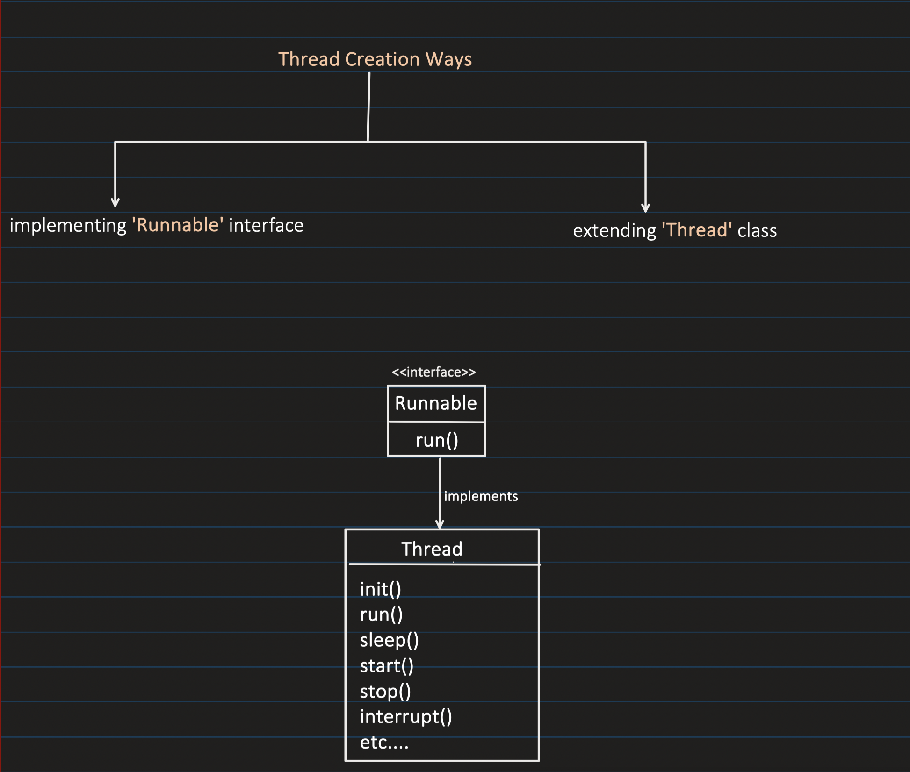
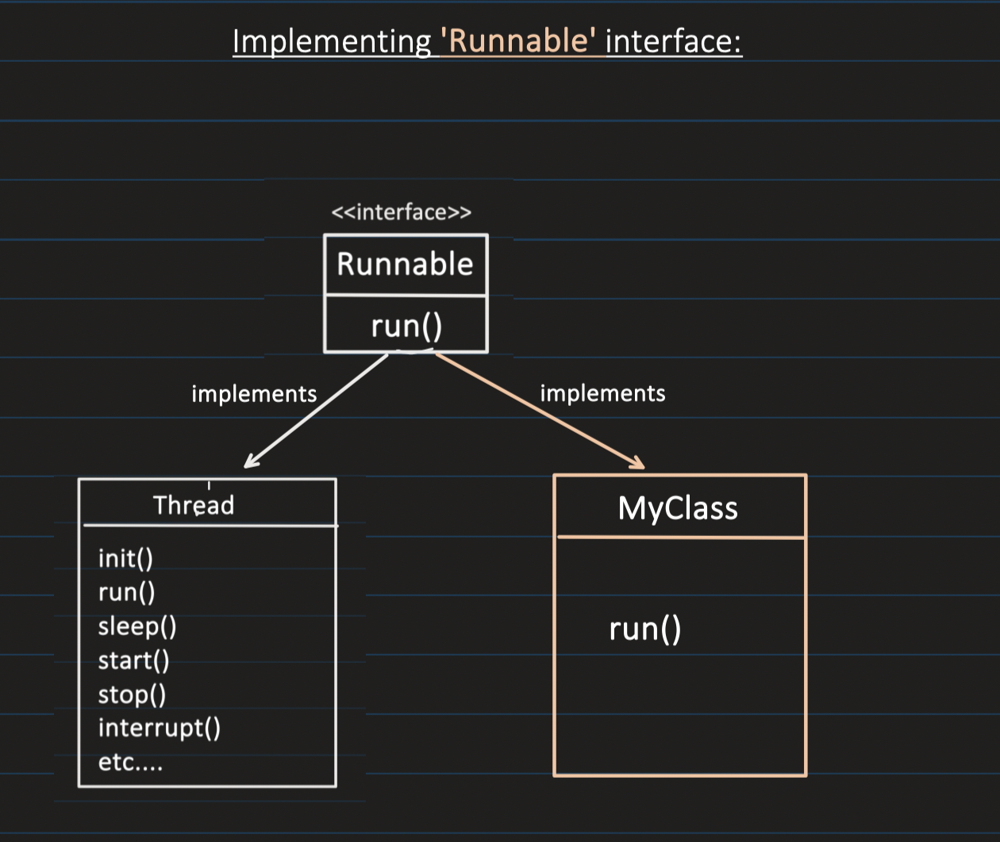
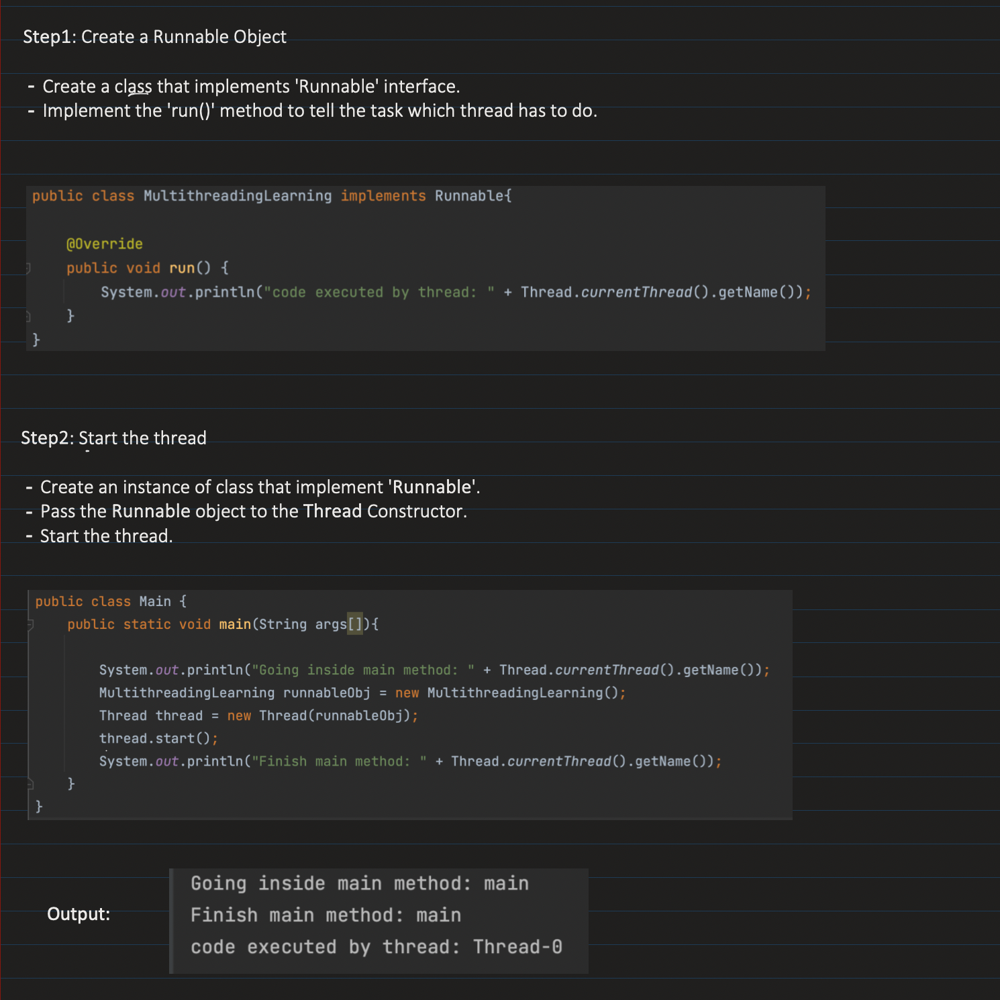
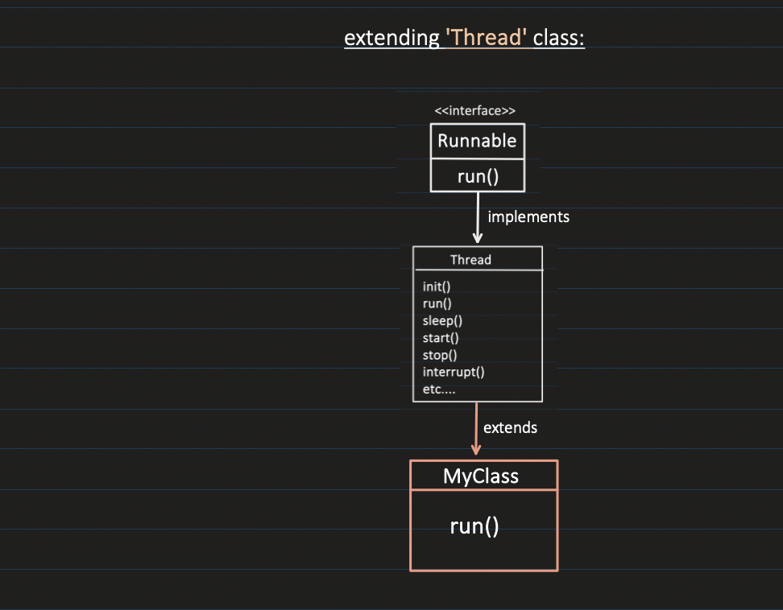
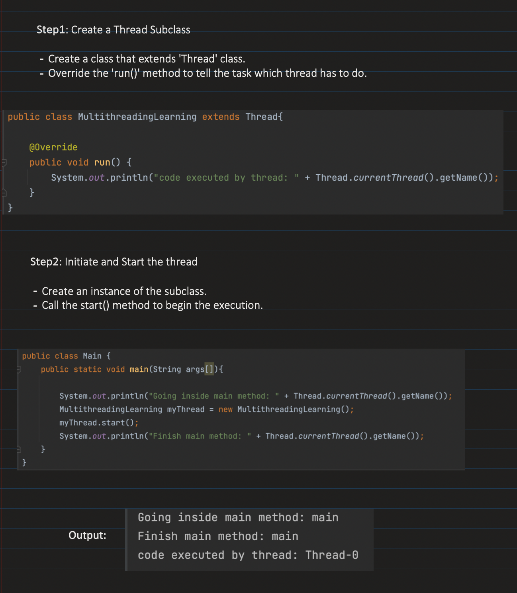
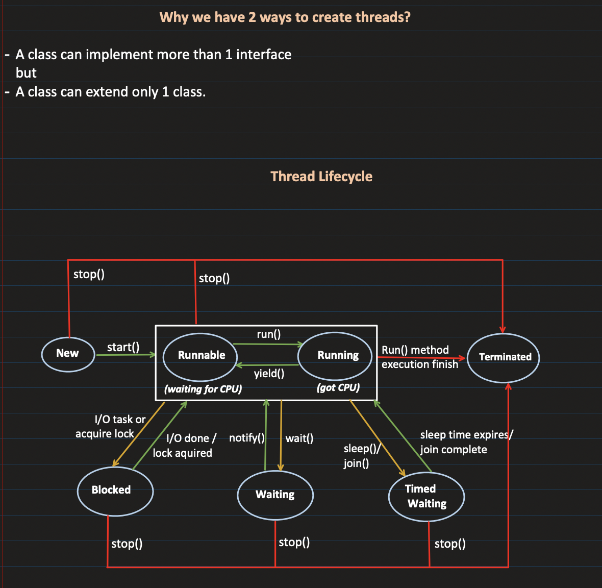
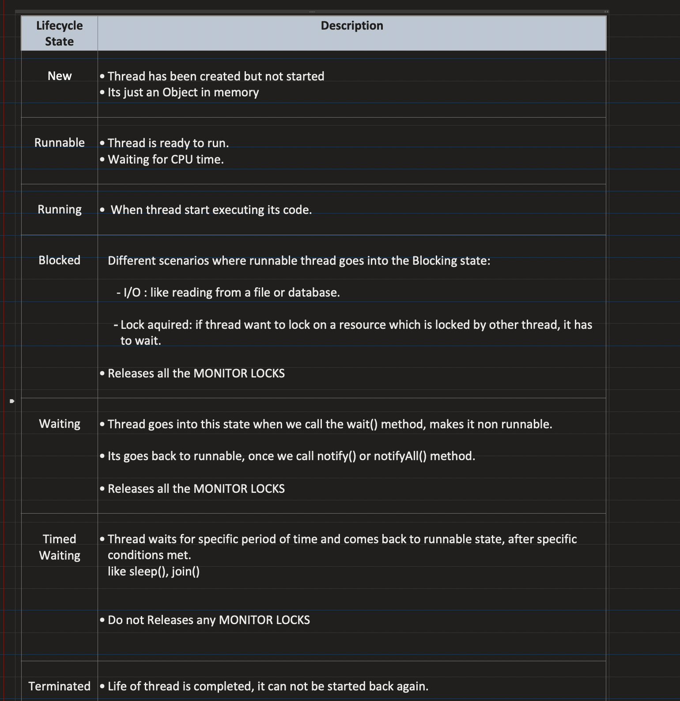
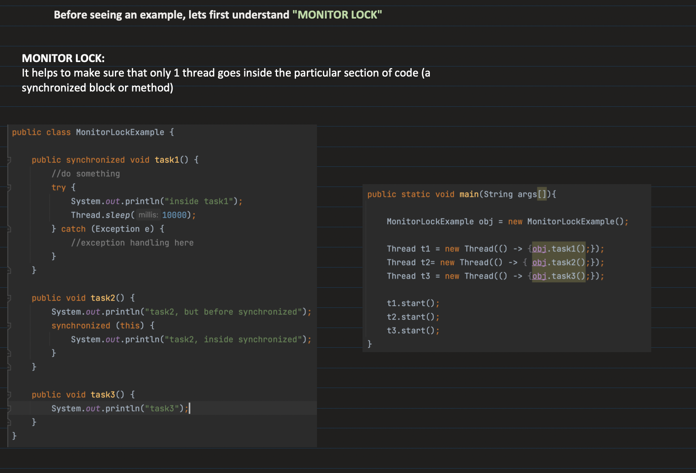
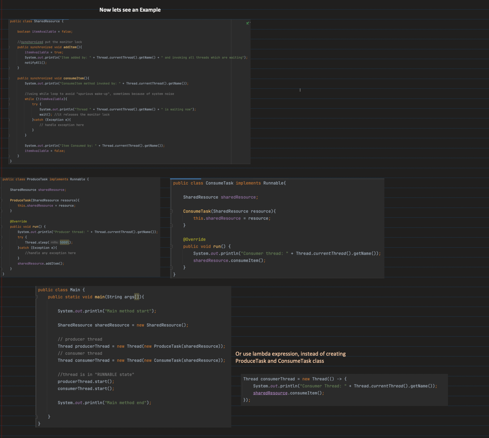
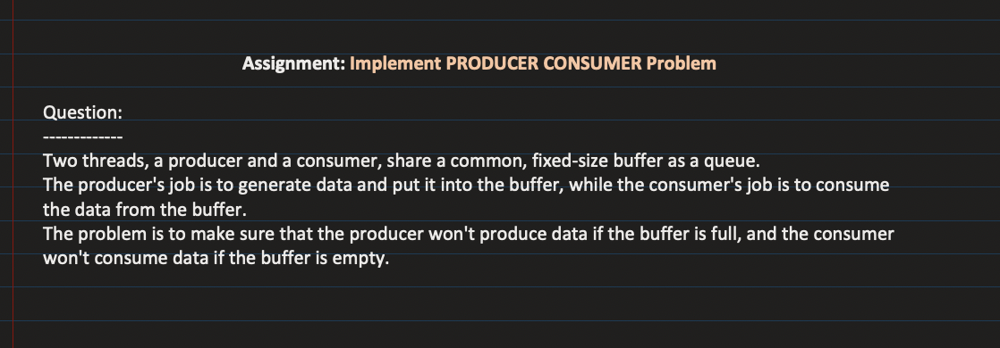

## [30. Thread Creation, Thread Lifecycle and Inter-Thread Communication | Multithreading in Java: Part2](https://www.youtube.com/watch?v=AYiE7_loIsE&ab_channel=Concept%26%26Coding-byShrayansh)

[Notes link]()

## Note: 👆 Monitor Lock will be at object level. Multiple sync blocks will be shared at object level. Each object has only 1 monitor lock, so even if 2 threads are trying to execute 2 diff critical sections of an object, only 1 will acq lock and execute first, while other remains locked for the lock to be released, even if both threads are working on diff methods.

 

