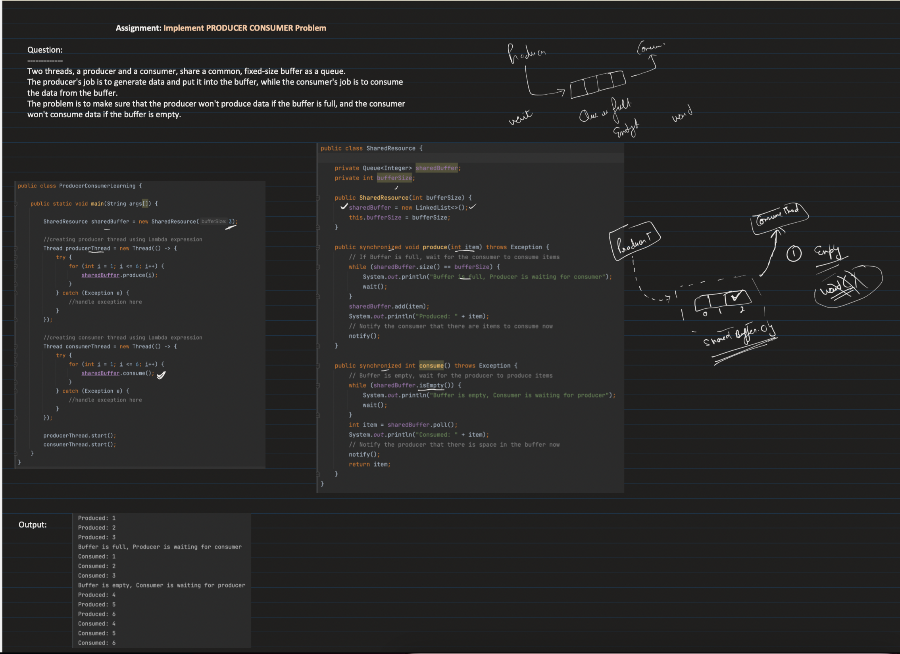
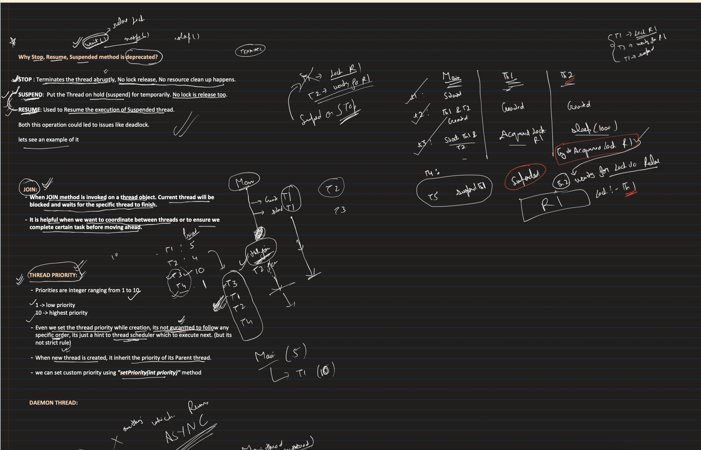

## Why thread stop(), suspend(), resume() is deprecated
- The suspend() method sends the thread in a suspnded state unless a resume is called.
- While in this state, it does not release the monitor lock on the shared resources
- Other threads might be waiting for these resources
- So this can cause deadlocks
- stop() releases all locks and leads to ThreadDeathException (silent unchecked exception) which leaves objects held by the thread in an inconsistent state. This is why it's deprecated

## [31. Thread Joining, Daemon Thread, Thread Priority | Multithreading in Java: Part3](https://youtu.be/cdsFwGDVzpg?si=6k3N-QZEBKtF82A8)

## Daemon thread 
- User thread vs Daemon thread 
- Daemon thread is alive only until there is atleast one user thread alive
- Uses: 
  - Garbage collector is a daemon thread
  - Auto save feature
