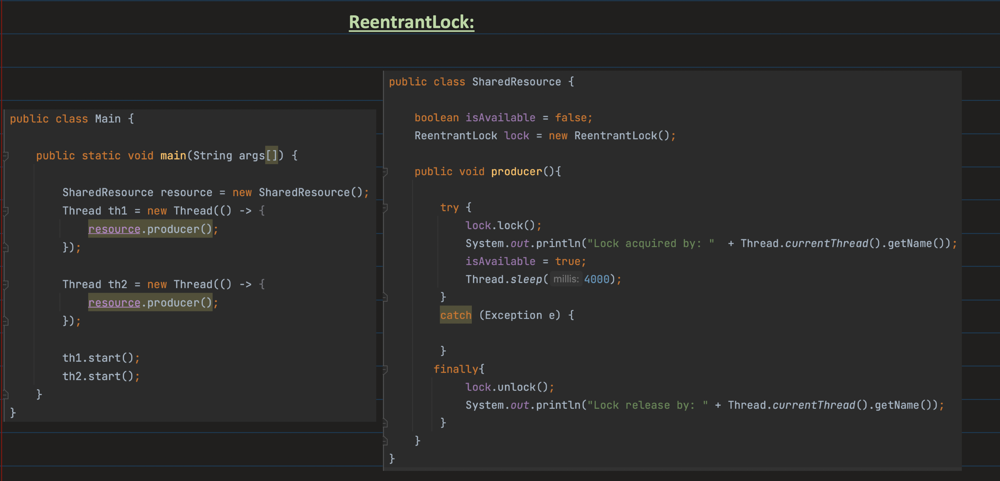
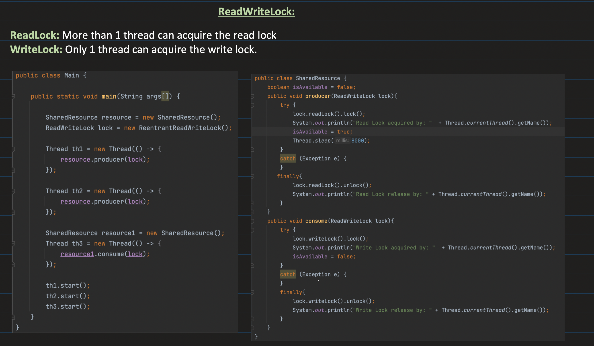
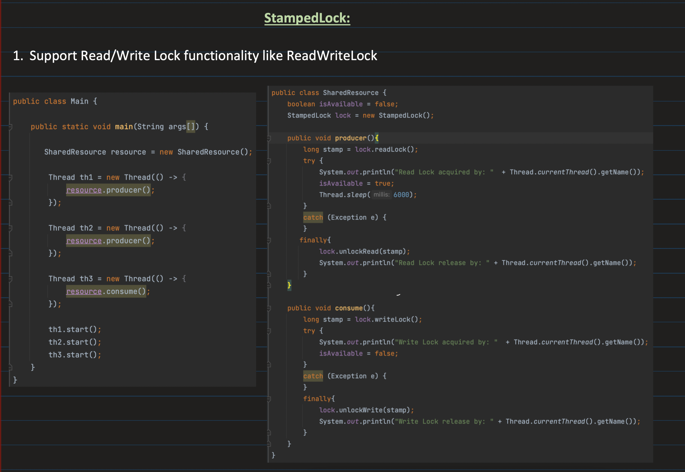
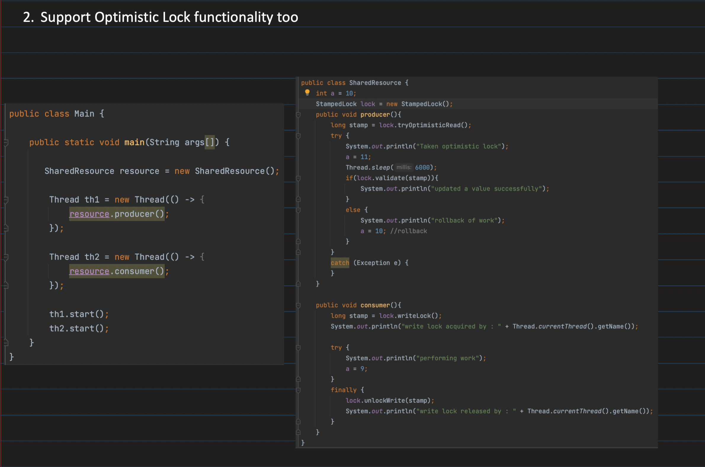
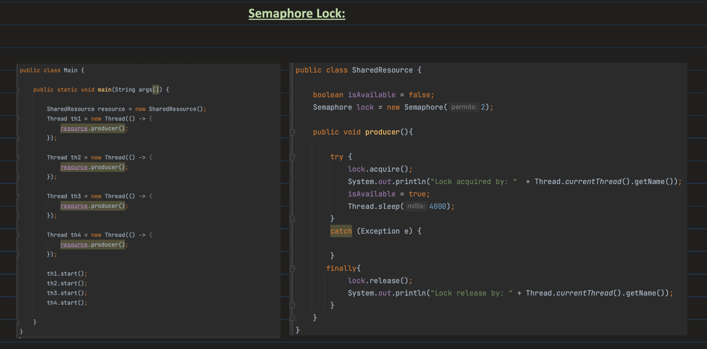
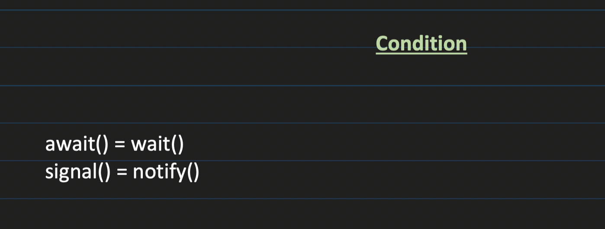

## [32. Locks and Condition | Java Multithreading Part4 | Reentrant, ReadWrite, Stamped & Semaphore Lock](https://youtu.be/DPob5NLzKFI?si=guM-Khvr05JAydMy)

Good blog: https://medium.com/@amitvsolutions/javas-synchronization-toolkit-the-locking-mechanism-882fbbe57921

Shared vs Exclusive locks:
- Shared lock: used for reads, multiple threads can read a resource at the same time.
- When a shared lock is acquired, no exclusive locks are allowed
- Exclusive locks: used for writes
- Only 1 exclusive lock allowed in a critical section at a time, no shared locks also allowed at this time

Pessimistic vs Optimistic locking:
- Optimistic lock doesn't really put a lock
- Only before writing, we check if the row we are updating has the same version as the row we had read before the write
- Similar to etag concept

