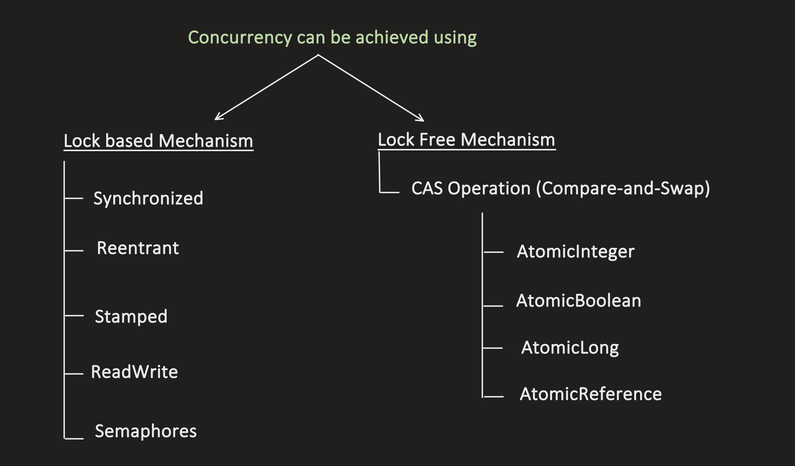
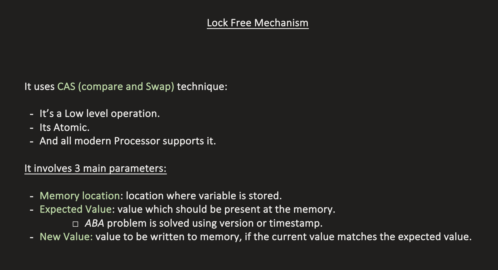
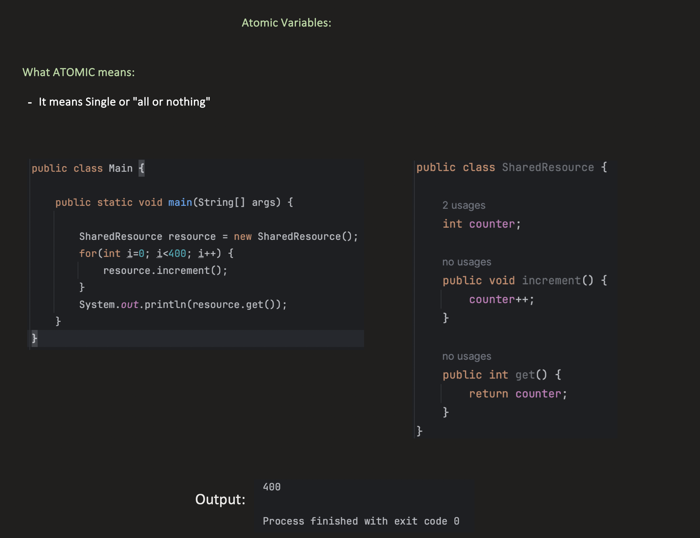
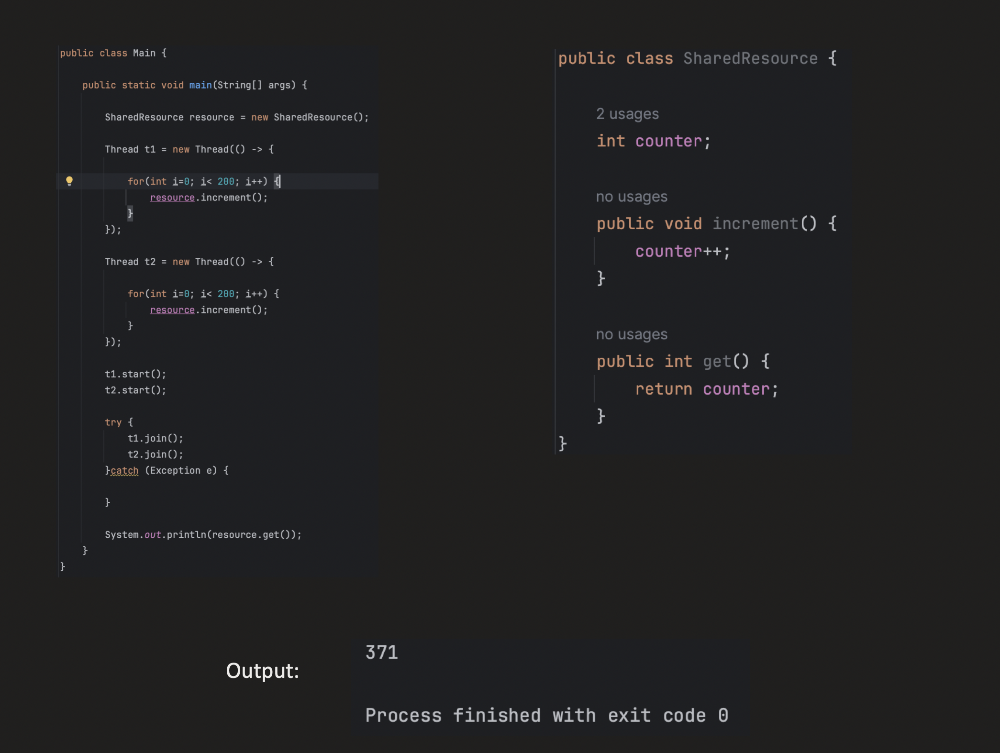
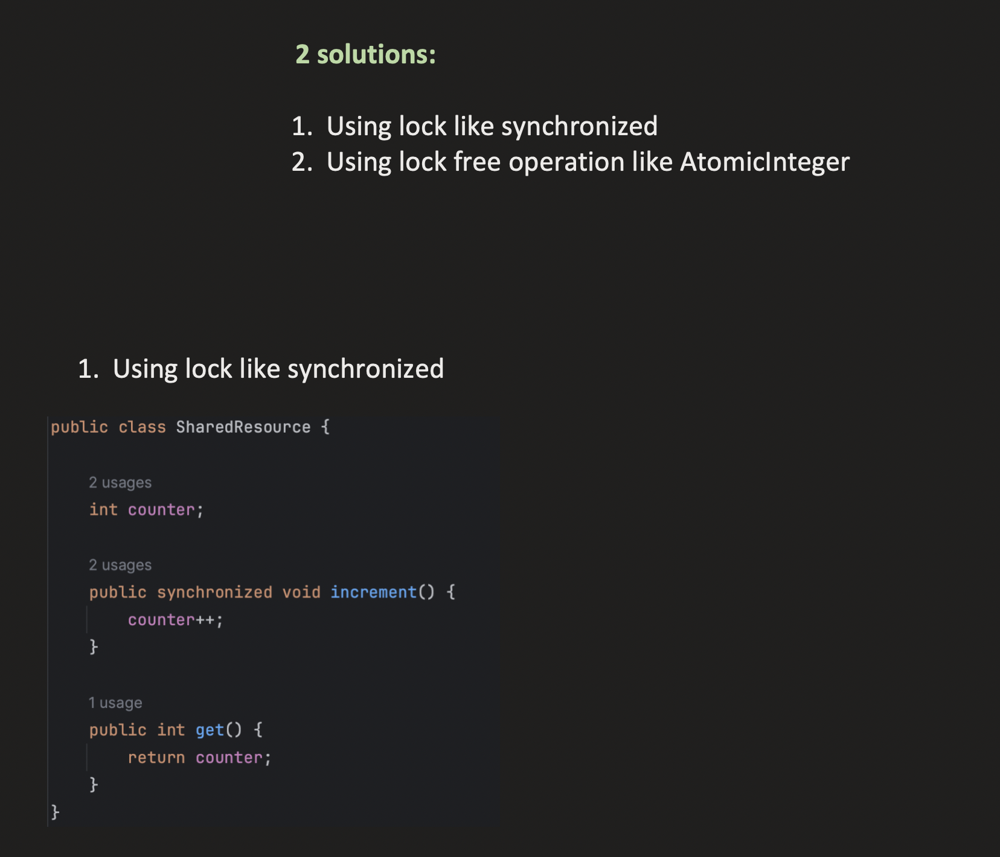
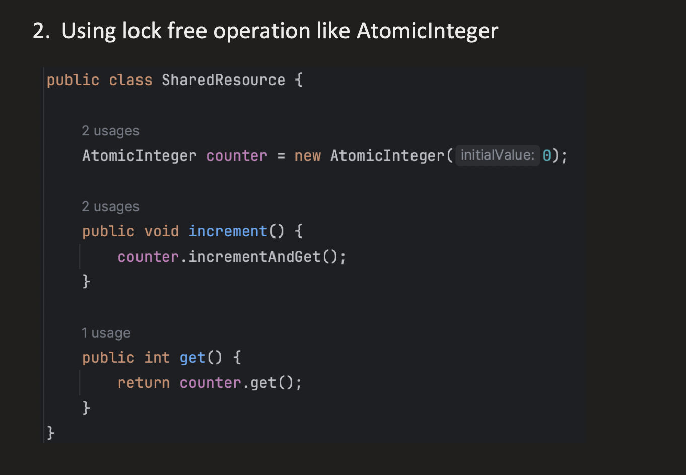
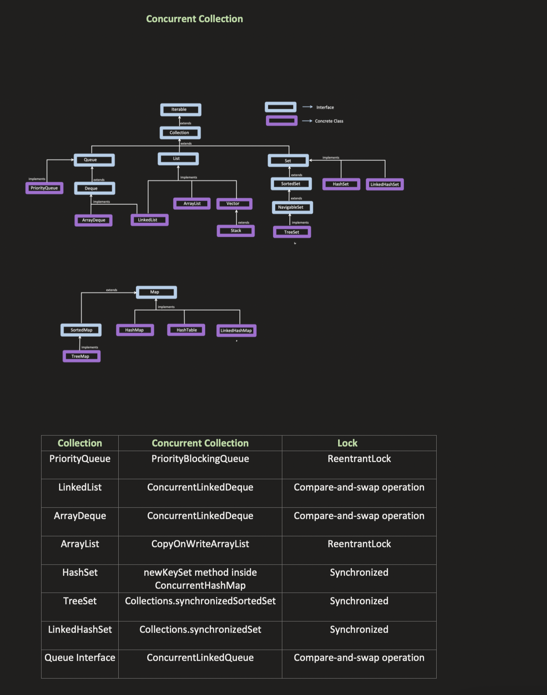

## [33. Lock-Free Concurrency | Compare-and-Swap | Atomic & Volatile Variables | Multithreading Part5](https://youtu.be/JGb4qNEBW6Q?si=oFoSKuF_1N7P1QYU)

ABA problem: 
- Say 3 threads are running parallely, all working on value=10
- 1 thread reads a value=10 from memory and updates it to 11
- 2nd thread again updates the value to 10
- Now, in case thread 3 wants to perform an update to value=13 using CAS, it will check the expected and actual values of value variable and find them to be matching (value=10)
- So t3 will update the value=13 which is wrong because the value=10 has undergone a few operations between thread 3's read and write.
- This is called ABA problem
- Can be solved by also taking version of current value into consideration and compare version of read and write before committing

## Volatile vs Atomic 
- Volatile has no relation with thread safetly
- Volatile ensures that read/write happens from RAM rather than l1/l2 cache as they may not have latest data among multiple cores

